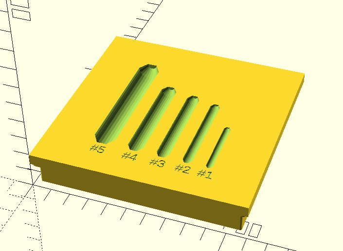

# Introduction

This Repository contains some organizers that are compatable with [Alex Chappel's Assortment System](https://www.alch.shop/shop/p/assortment-system-master-set). These organizers are generated using [OpenScad](https://www.openscad.org/) an open source software package for creating solid 3D CAD models.

## What Is Included

### Center Drill Bits

The [center-drill-bits-all](./center-drill-bits-all.stl) is a holder for center drill bits for a lathe or mill. This holder is designed to accept #8 through #00.


The [center-drill-bits-1-5](./center-drill-bits-1-5.stl) is similar to center-drill-bits-all but it instead holds the bits from #5 to #1.



#### Customization

If you need a holder for a different set of center drill bits, it is simple to create a new holder by taking advantage of `center-drill-bits-lib.scad` .

The example bellow is the source for a new holder that only contains slots for bits `#4` - `#1`

```scad
use<center-drill-bits-lib.scad>;

bits = [
    // ["5", 7/16, 3/16, 3/16, 2+3/4],
    ["4", 5/16, 1/8, 1/8, 2+1/8],
    ["3", 1/4, 7/64, 7/64, 2],
    ["2", 3/16, 5/64, 5/64, 1 + 7/8],
    ["1", 1/8, 3/64, 3/64, 1 + 1/4]
];

bitsTop(bits);
```

## Developing

In order to rebuild and tweak the scad files you will need to purchase Alex Chappel's models, and then unzip the repository into the root of this repository.


This is required because we import the and use the included STLs directly in the scad files.